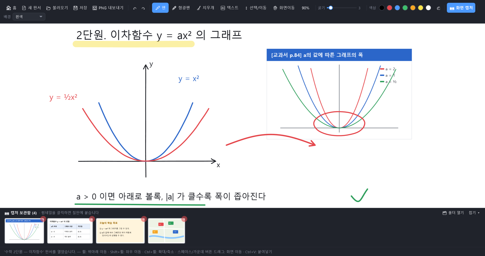
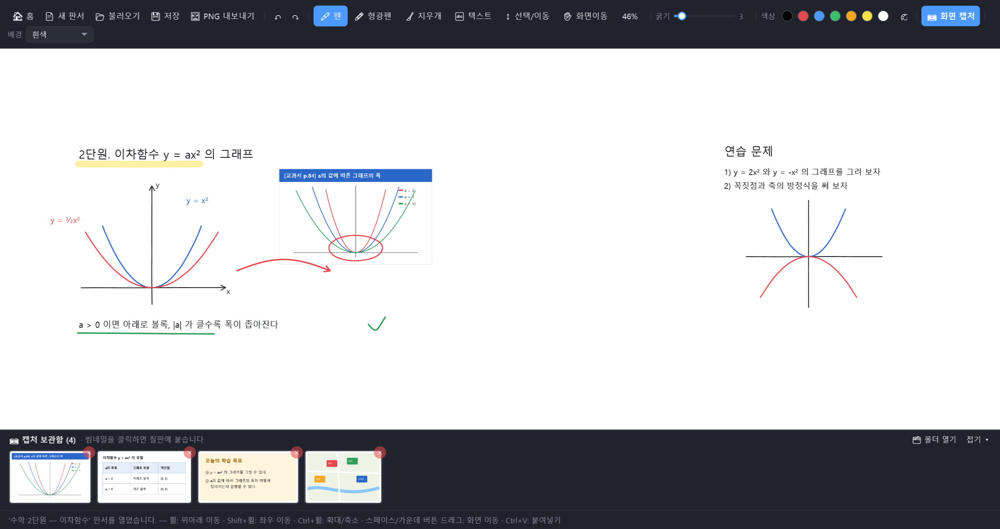
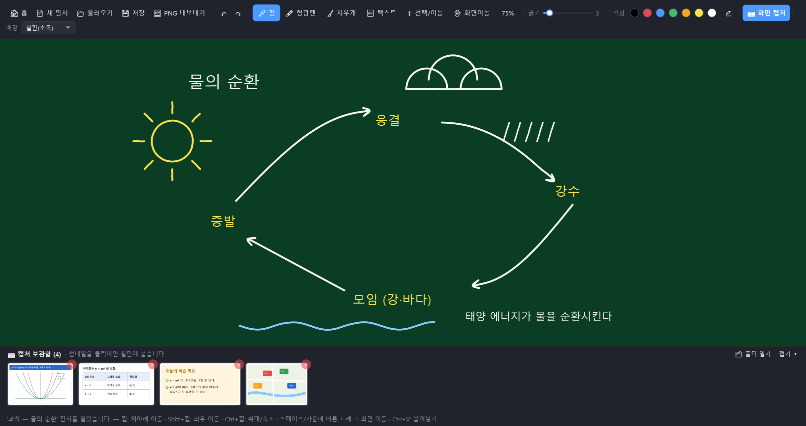
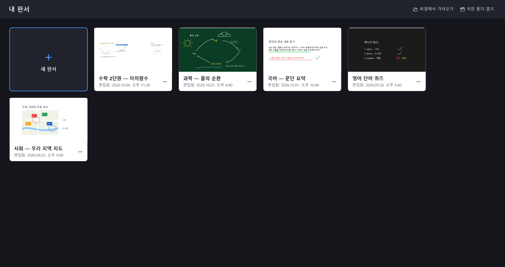

# 교육용 판서 프로그램 (Edu Whiteboard)

수업·강의에서 쓰기 위한 Windows용 판서(화이트보드) 프로그램입니다.
Microsoft Whiteboard처럼 무한히 넓은 칠판에 펜으로 쓰고, 화면 캡처나 복사한 이미지·텍스트를 붙여 그 위에 바로 판서할 수 있습니다.

C# / WPF (.NET 8)로 만들었습니다. **[최신 버전 다운로드 →](https://github.com/ngnicky-ai/edu-whiteboard/releases/latest)**



> 화면 캡처는 모두 예시 내용으로 만든 실제 프로그램 화면입니다.

## 주요 기능

### 판서 도구

- **펜**: 색상 7가지 기본 팔레트 + 사용자 지정 색, 굵기 조절(1~30)
- **형광펜**: 반투명으로 겹쳐 칠하기 (위 화면의 제목 밑 노란 줄)
- **지우개**: 지나간 부분만 지우기
- **텍스트**: 칠판을 클릭한 곳에 바로 글자 입력 (글자 크기 10~120, 펜 색 적용, Esc로 입력 마침)
- **선택/이동**: 붙여넣은 이미지·텍스트를 옮기고, 크기를 바꾸고, 삭제
- 실행취소 / 다시실행

### 화면 캡처와 캡처 보관함

위 화면 아래쪽 줄이 **캡처 보관함**입니다.

- **📷 화면 캡처**: 드래그로 영역을 고르면 원본 색 그대로 캡처되어 보관함에 썸네일로 모입니다. 고르는 동안 선택 영역은 파란 테두리로 표시됩니다 (고해상도 모니터 배율 대응).
- 썸네일을 **클릭하면** 지금 보고 있는 칠판 위치에 붙습니다. 같은 캡처를 여러 번, 다른 판서에서도 다시 쓸 수 있습니다.
- **✕**로 삭제(휴지통으로 이동), **접기**로 숨겨서 칠판을 넓게 쓸 수 있습니다.
- **Ctrl+V**: 엑셀 셀, 외부 캡처 프로그램(Snagit, 캡처 도구 Win+Shift+S 등), 브라우저에서 복사한 그림, 탐색기에서 복사한 이미지 파일, 텍스트를 붙여넣습니다. 붙여넣은 그림은 칠판에 바로 붙고 캡처 보관함에도 저장됩니다.
- 붙여넣은 그림은 화면에 보이던 크기 그대로 놓입니다.

### 무한 칠판



- 페이지 크기 제한 없이 상하좌우로 넓게 씁니다. 위 화면은 46%로 축소해서, 수업 내용 오른쪽 멀리 적어 둔 연습 문제까지 한눈에 본 모습입니다.
- **화면 이동**: 마우스 휠, Shift+휠, 스페이스바+드래그, 가운데 버튼 드래그, "✋ 화면이동" 도구
- **확대/축소**: Ctrl+휠(마우스 위치 기준), Ctrl+가운데 버튼 드래그 (10%~400%). 툴바의 % 버튼이나 Ctrl+0으로 100%로 돌아옵니다.
- **PNG 내보내기**: 현재 화면에 보이는 영역을 모니터 해상도로 저장합니다.

### 칠판 배경



- 배경을 **흰색 / 칠판(검정) / 칠판(초록)** 중에서 고를 수 있습니다. 칠판 배경에서는 붙여넣은 텍스트가 흰색으로 들어가 잘 보입니다.

### 홈 화면과 자동 저장



- 앱을 켜면 이전 판서들이 **썸네일 카드**로 나오고, 클릭하면 이어서 작업합니다.
- **자동 저장**: 홈으로 갈 때, 다른 판서를 열 때, 앱을 닫을 때, 작업 중 1분마다
- 카드 메뉴(···)에서 이름 바꾸기, 삭제(휴지통으로 이동)
- 다른 곳의 `.wbd` 파일 가져오기

## 단축키

| 동작 | 단축키 |
| --- | --- |
| 붙여넣기 | Ctrl+V |
| 실행취소 / 다시실행 | Ctrl+Z / Ctrl+Y |
| 저장 | Ctrl+S |
| 파일 가져오기 | Ctrl+O |
| 선택한 개체 삭제 | Delete |
| 위아래 / 좌우 이동 | 휠 / Shift+휠 |
| 화면 이동 | 스페이스바 누른 채 드래그, 가운데 버튼 드래그 |
| 확대/축소 | Ctrl+휠, Ctrl+가운데 버튼 드래그 |
| 100%로 되돌리기 | Ctrl+0 |
| 텍스트 입력 마침 | Esc |

## 다운로드

[Releases](https://github.com/ngnicky-ai/edu-whiteboard/releases/latest)에서 `EduWhiteboard-버전-win-x64.exe`를 받아 바로 실행하세요.
.NET 런타임이 포함된 단일 실행 파일이라 따로 설치할 것이 없습니다 (Windows 10/11, 64비트).
서명되지 않은 프로그램이라 처음 실행할 때 SmartScreen 경고가 나오면 "추가 정보" → "실행"을 누르세요.

## 소스에서 실행하기

필요한 것: Windows 10/11, [.NET 8 SDK](https://dotnet.microsoft.com/download/dotnet/8.0)

```powershell
git clone https://github.com/ngnicky-ai/edu-whiteboard.git
cd edu-whiteboard/src/WhiteboardApp
dotnet run
```

Releases에 올라간 것과 같은 단일 실행 파일을 직접 만들려면:

```powershell
dotnet publish src/WhiteboardApp/WhiteboardApp.csproj -c Release -r win-x64 --self-contained true `
  -p:PublishSingleFile=true -p:IncludeNativeLibrariesForSelfExtract=true -p:EnableCompressionInSingleFile=true
```

## 판서 파일

- 판서는 `문서\교육용 판서` 폴더에 `.wbd` 파일로 저장됩니다.
- 캡처 보관함의 그림은 `문서\교육용 판서\캡처 보관함` 폴더에 PNG로 저장됩니다.
- `.wbd`는 ZIP 형식이며 다음을 담고 있습니다.
  - `manifest.json` — 제목, 배경, 이미지·텍스트 개체의 위치와 크기
  - `pages/page1.isf` — 펜 획 (Ink Serialized Format)
  - `images/*.png` — 붙여넣은 이미지 원본
  - `thumbnail.png` — 홈 화면용 미리보기

## 프로젝트 구조

```
src/WhiteboardApp
├── Views/        MainWindow — 홈 화면, 툴바, 무한 칠판, 붙여넣기/저장 흐름
├── Controls/     화면 캡처 오버레이, 이동·크기조절 가능한 개체, 색상 선택, 이름 입력 창
├── Services/     파일 저장/불러오기, 판서 목록(라이브러리), 클립보드 이미지 해석, PNG 내보내기, 화면 캡처
├── ViewModels/   도구 상태, 홈 화면 카드, 캡처 보관함 항목
├── Assets/       앱 아이콘
└── Models/       저장 파일 구조
docs/screenshots  README용 화면 캡처
```

판서 저장 폴더는 환경 변수 `EDU_WHITEBOARD_LIBRARY`로 바꿀 수 있습니다 (테스트나 화면 캡처용).

## 앞으로 추가할 기능

- 여러 페이지, 모눈·줄노트·좌표평면 배경
- 도형(직선·사각형·원·화살표), 도장(O/X, 체크)
- 레이저 포인터, 스포트라이트(가림막), 타이머
- 다른 프로그램 위에 판서하는 오버레이 모드
